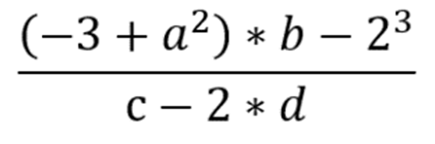
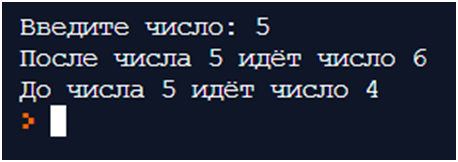
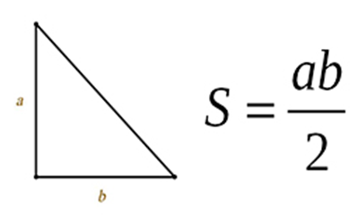
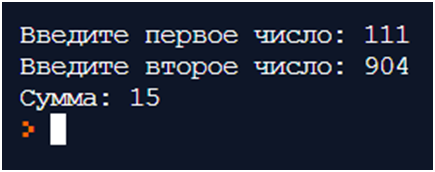

## Задача 1. Язык математики

**Что нужно сделать**

Маше для защиты курсовой работы нужно написать программу для расчёта экономической модели по формуле. Как записать саму формулу в программу, она не знает, у неё есть только начальные значения. Поэтому Маша решила просто заплатить Егору, чтобы тот написал её быстрее.
Дана программа:

a = 8

b = 10

c = 12

d = 18

Продолжите программу: переведите выражение с математического языка на язык Python, запишите его в переменную res и выведите результат.

**Выражение:**

## Задача 2. Финансовый отчёт

**Что нужно сделать**

Наде дали задание сформировать финансовый отчёт за последние 20 лет по полугодиям. Нужно сумму дохода первых двух кварталов поделить на сумму последних двух кварталов, чтобы понять динамику роста или падения дохода. И так за каждый год. Надя решила, что быстрее будет написать простую программу, которая сделает всё за неё.

1. Запросите у пользователя четыре числа.
2. Отдельно сложите два первых и отдельно — два вторых.
3. Разделите первую сумму на вторую.
4. Выведите результат на экран.

## Задача 3. Следующее и предыдущее числа

**Что нужно сделать**

Напишите программу, которая получает от пользователя число и выводит на экран два ответа — следующее и предыдущее числа.

**Результат:**

## Задача 4. Площадь треугольника

**Что нужно сделать**

Напишите программу, которая запрашивает у пользователя длины двух катетов
в прямоугольном треугольнике и выводит его площадь.

**Советы и рекомендации**

1. Не стоит применять целочисленное деление, это не совсем корректно.
2. Обратите внимание на написание переменной S: её нужно писать s — со строчной.

## Задача 5. Часы

**Что нужно сделать**

Напишите программу, которая получает на вход число n (количество минут), затем считает, сколько это будет в часах и сколько минут останется, и выводит на экран эти два результата.

## Задача 6. Проверяем бухгалтера

**Что нужно сделать**

Невнимательный бухгалтер Антон складывает числа быстро, но иногда забывает о двух последних разрядах. Напишите программу, которая бы складывала только два последних разряда.

Реализуйте программу, которая запрашивает два числа у пользователя. После этого у каждого числа возьмите две последние цифры. Получившиеся два числа сложите и выведите на экран.

**Пример:**

## Задача 7. Поездка по кругу

**Что нужно сделать**

Вася решил потренироваться перед марафоном и покататься вокруг Москвы на скорость. Длина дороги — 115 километров. Вася стартует с нулевого километра и едет со скоростью v километров в час. На какой отметке он остановится через t часов?

Реализуйте программу, которая спрашивает у пользователя v и t и выводит целое число от 0 до 114 — номер километра, на котором остановится Вася. Учтите, что он может прокатиться больше одного круга.

## Задача 8. «Режем» число на части

**Что нужно сделать**

Реализуйте программу, которая получает на вход четырёхзначное число и выводит на экран каждую его цифру отдельно (в одну строчку либо каждую цифру в новой строчке). Само число при этом изменять нельзя, то есть нужно обойтись без переприсваивания. Однако можно использовать сколько угодно переменных.

## Задача 9. В обратном порядке

**Что нужно сделать**

Реализуйте программу, которая получает на вход четырёхзначное число и выводит его на экран в обратном порядке. Само число при этом изменять нельзя, то есть нужно обойтись без переприсваивания. Однако можно использовать сколько угодно переменных. Пример ввода: 1234. Пример вывода: 4321.

## Задача 10. Поменять местами: не всё так просто! (необязательная, повышенной сложности)

**Что нужно сделать**

Мы умеем менять местами строковые переменные и знаем, что в переменных, кроме строк, можно хранить и числа. Напишите программу, которая меняла бы значения двух переменных местами, но без использования третьей переменной и синтаксического сахара, который мы разбирали, а именно — без конструкции a,b = b,a. В переменные будут вводиться только числа.

a = int(input('Введите первое число: '))

b = int(input('Введите второе число: '))

print(a, b)

#стереть эту строчку и вставить свой код здесь

print(a, b)

Изменять, удалять, менять местами 1-ю, 2-ю, 3-ю и последнюю строчки нельзя.

Но между 3-ей и 4-ой строкой можно вставлять сколько угодно строк кода, не трогая последний принт.
