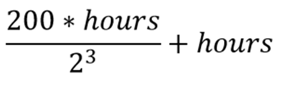

## Задача 1. Датчик погоды

**Что нужно сделать**

В квартире за окном стоит датчик погоды, который определяет, идёт дождь или нет. Если пошёл дождь, датчик оповещает владельцев сообщением: «Пошёл дождь. Возьмите зонтик!»

Напишите программу, которая получает на вход число 0 или 1. Единица означает, что дождь идёт. Если дождь идёт, то выводите на экран сообщение: «Пошёл дождь. Возьмите зонтик!»

Пример 1:

- На улице идёт дождь? 1
- Пошёл дождь. Возьмите зонтик!

Пример 2:

- На улице идёт дождь? 0

## Задача 2. Поступление

**Что нужно сделать**

Степан хочет поступить на бюджет в престижный университет, но для этого ему нужно хорошо сдать три экзамена и набрать как минимум 270 баллов.

Напишите программу, которая запрашивает у пользователя результаты ЕГЭ по трём экзаменам и проверяет, поступил он на бюджет или нет. Выведите соответствующее сообщение.

Пример 1:

- Введите количество баллов по русскому языку: 90
- Введите количество баллов по математике: 90
- Введите количество баллов по информатике: 90
- Поздравляю, ты поступил на бюджет!

Пример 2:

- Введите количество баллов по русскому языку: 100
- Введите количество баллов по математике: 50
- Введите количество баллов по информатике: 70
- К сожалению, ты не прошёл на бюджет.

## Задача 3. Следим за зубами

**Что нужно сделать**

Стоматолог посоветовал Маше использовать зубную нить каждый чётный день. Чтобы не забывать, Маша написала скрипт на Python, который в случае чего напоминает ей о совете стоматолога.

Напишите программу, которая проверяет, чётное ли число ввёл пользователь, и выводит соответствующее сообщение.

Подсказка: для проверки чётности используйте оператор %.

## Задача 4. Калькулятор скидки

**Что нужно сделать**

Андрей переехал в новую квартиру, и ему нужно купить три стула в разные комнаты. Естественно, цена на стулья в разных магазинах различается, а где-то ещё и скидка есть. Вот для одного из таких магазинов он и написал калькулятор скидки, чтобы проще ориентироваться в ценах.

Напишите программу, которая запрашивает три стоимости товара и вычисляет сумму чека. Если сумма чека превышает 10 000 рублей, нужно вычесть из этой суммы скидку 10% (умножить на 10, разделить на 100). В конце вывести итоговую сумму на экран.

## Задача 5. Модуль числа

**Что нужно сделать**

Математик Саша пишет программу, которая должна строить график функции y = |x|. Для этого ему нужно найти модуль очередного числа x, то есть если число x отрицательное, то перевести его в положительное.

Напишите программу, которая выводит на экран модуль введённого числа.

Пример:
Ввели 5, ответ 5
Ввели −7, ответ 7

**Подсказка:** достаточно в некоторых случаях переприсвоить переменную со знаком минус.

## Задача 6. Игра в кубики

**Что нужно сделать**

Костя играет в азартную игру с кубиками с владельцем заведения. Правда, с довольно интересными правилами: если у Кости на кубике выпадет столько же или больше, чем у владельца, то Костя задолжает разность в тысячах долларов. Однако если выпадет меньше, то Косте выплатят столько тысяч долларов, сколько будет сумма очков на кубиках.

Напишите программу. На вход в программу подаётся два числа. Если первое число больше либо равно второму, нужно вывести на экран их разность и отдельной строкой фразу: «Костя платит». В противном случае вывести их сумму и отдельной строкой — фразу: «Владелец платит». Также последней строкой в результате нужно вывести на экран фразу: «Игра окончена».

Пример:

- Кубик Кости: 3
- Кубик владельца: 4
- Сумма: 7
- Владелец платит
- Игра окончена

**Рекомендация**
Обратите внимание на разный выигрыш, который получит Костя при различных исходах.

## Задача 7. Банкомат

**Что нужно сделать**

Пользователи банкомата хотят снимать деньги. Но банкомат выдаёт только купюры по 100 рублей.
Напишите программу, которая проверяет допустимость денежной суммы, которую ввёл пользователь.

Пример:

- Введите сумму, которую хотите снять: 250
- Такую сумму снять невозможно. Обратитесь в другой банкомат.

## Задача 8. Хватит ли зарплаты

**Что нужно сделать**

Георгий работает неофициально по часам, и его зарплата высчитывается по следующей формуле:

Он хочет понять, сколько часов нужно отработать, чтобы хватило на погашение кредита и еду.

Напишите программу, которая запрашивает у пользователя три числа: количество отработанных часов, остаток по кредиту и количество денег на еду. После этого рассчитывается зарплата по формуле, и если зарплата больше либо равна денежной сумме, которая требуется на кредит и еду, то выводится сообщение: «Часов хватает. Можно отдохнуть», в противном случае: «Часов не хватает. Придётся работать!».

Пример:

- Введите отработанные часы: 80
- Введите остаток по кредиту: 1000
- Введите траты на еду: 5000
- Часов не хватает. Придётся работать!

## Задача 9. Плохой циферблат

**Что нужно сделать**

У Саши в грузовике стоит суперсовременный цифровой циферблат для подсчёта пробега, но он постоянно сбрасывается. Саша заметил закономерность: каждый раз, когда сумма цифр пробега на циферблате превышает число текущего дня, циферблат сбрасывается.

Напишите программу, которая получает на вход от пользователя два числа: трёхзначное число пробега и число дня, затем находит сумму цифр первого числа и, если эта сумма больше числа дня, выводит сообщение «Сброс» и сбрасывает пробег до нуля. В противном случае выводится: «Сегодня не сломался». В конце также выводится сам пробег.

Пример 1:

- Введите пробег: 123
- Введите сегодняшнее число: 5
- Сброс.
- Пробег: 0

Пример 2:

- Введите пробег: 123
- Введите сегодняшнее число: 10
- Сегодня не сломался.
- Пробег: 123

## Задача 10. Максимальное число (по желанию)

**Что нужно сделать**

Пользователь вводит три числа.
Напишите программу, которая выводит на экран максимальное из этих трёх чисел (все числа разные). Используйте дополнительные переменные, если нужно.
