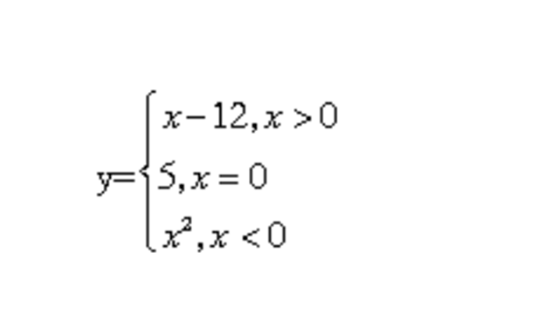

## Задача 1. Калькулятор опыта

**Что нужно сделать**

Андрей любит играть в компьютерные игры. В один прекрасный день у него появилась классная идея для сюжета своей игры. Чтобы воплотить её в жизнь, он начал изучать программирование и геймдизайн. Начал он с главного героя и его системы прокачки.

Напишите программу, которая определяет уровень персонажа в компьютерной игре. Пользователь вводит число «очков опыта», а программа вычисляет уровень. Новый уровень даётся при достижении 1000, 2500 и 5000 «очков опыта». Начальный уровень равен единице.

Пример:

- Введите количество опыта: 6000
- Ваш уровень: 4

Пример 2:

- Введите количество опыта: 2000
- Ваш уровень: 2

**Советы и рекомендации**

По возможности уделите внимание сокращению кода и избегайте проверять условия, которые уже были проверены. Если вы проверили условие condition, то не следует проверять not condition после.

## Задача 2. Максимум из трёх чисел 2

**Что нужно сделать**

У нас уже было задание на нахождение максимума из трёх чисел с помощью дополнительной переменной. Теперь, когда вы знаете намного больше, вы можете оптимизировать программу, не тратя память компьютера на лишние переменные.

Напишите программу, которая находит максимум из трёх чисел, не используя дополнительные переменные.

**Советы и рекомендации**

По возможности уделите внимание сокращению кода и избегайте проверять условия, которые уже были проверены. Если вы проверили условие condition, то не следует проверять not condition после.

## Задача 3. Функция

**Что нужно сделать**

Учитель математики придумывает каждому своему ученику отдельные функции, которые нужно отобразить на графике и посчитать. А ещё этот учитель разбирается в программировании. Поэтому, чтобы не считать вручную все эти функции, он написал программу, которая делает всю работу за него.

Напишите программу, которая получает от пользователя число X и вычисляет значение функции Y по следующей схеме:

y= {x −12, x>0, 5, x=0 x², x<0


Напомним, как это работает:

- для X > 0, Y = X − 12
- для X = 0, Y = 5
- для X < 0, Y = X²

Пример:

- Введите икс: 0
- Игрек равен 5

Пример 2:

- Введите икс: −6
- Игрек равен 36

**Советы и рекомендации**

По возможности уделите внимание сокращению кода и избегайте проверять условия, которые уже были проверены. Если вы проверили условие condition, то не следует проверять not condition после.

## Задача 4. Поступление

**Что нужно сделать**

В университете на факультет кибернетики очень серьёзный конкурс — поступают только сильнейшие, первые десять человек из списка. Потом среди поступивших определяется, кто будет получать стипендию. Для стипендии общий балл при поступлении должен быть не менее 290.

Напишите программу, которая получает на вход место студента в списке и его балл, а затем выводит соответствующие сообщения о поступлении и получении стипендии.

Пример 1:

- Введите место в списке поступающих: 3
- Введите количество баллов за экзамены: 295
- Поздравляем, вы поступили!
- Бонусом вам будет начисляться стипендия.

Пример 2:

- Введите место в списке поступающих: 3
- Введите количество баллов за экзамены: 270
- Поздравляем, вы поступили!
- Но вам не хватило баллов для стипендии.

Пример 3:

- Введите место в списке поступающих: 11
- К сожалению, вы не поступили.

## Задача 5. Опять двойка

**Что нужно сделать**

Папа-программист уже настолько обленился, что вместо того, чтобы самому спросить у сына, какую оценку тот получил в школе, он написал для этого вот такую программу:

```
rating = int(input('Что получил по математике? '))
if rating == 2:
   print('Плохо. Маршучиться!')
if rating == 3:
   print('Плохо. Маршучиться!')
if rating == 4:
   print('Молодец! Можешьотдохнуть.')
if rating == 5:
   print('Молодец! Можешьотдохнуть.')
```

Сын после того, как «сообщил» свою оценку, посмотрел на код программы и понял, что её можно улучшить, и даже рассказал папе, как это сделать, за что получил безграничное уважение отца.

Скопируйте программу в редактор и оптимизируйте:

1. При плохой оценке (2 или 3) выводится сообщение: «Плохо. Марш учиться!»
2. При хорошей оценке (4 или 5) выводится сообщение: «Молодец! Можешь отдохнуть».
3. В программе не должно быть повторяющихся строк.

**Что оценивается**

В программе отсутствуют повторяющиеся строки.

## Задача 6. Защита от дурака

**Что нужно сделать**

Вы участвуете в разработке приложения для математиков, где можно будет делать всё, начиная от простейших вычислений и заканчивая построением сложных графиков. В этом приложении реализована установка диапазона чисел, и вам необходимо написать этакую «защиту от дурака».

Напишите программу, которая получает на вход число и проверяет, двузначное оно или нет. Выведите соответствующее сообщение. Числа −42 и −99 тоже считаются двузначными. Сделайте это, используя не более одного оператора if-elsе. Не используйте elif.

## Задача 7. Костя хочет выигрывать

**Что нужно сделать**

После игры в кубики Костя захотел немного изучить работу игровых автоматов, а заодно математику и теорию вероятностей. Но ему нужно с чего-то начать: написать программу, которая поможет выявить закономерности в комбинациях чисел на автомате.

Даны три целых числа. Определите, сколько среди них совпадающих. Программа должна вывести одно из чисел: 3 (если все совпадают), 2 (если два совпадают) или 0 (если все числа различны).

**Советы и рекомендации**

По возможности уделите внимание сокращению кода и избегайте проверки условий, которые уже были проверены. Если вы проверили условие condition, то не следует проверять not condition после.

## Задача 8. Новоселье

**Что нужно сделать**

Семья из трёх человек устала тесниться в однушке и наконец решила переехать. При обсуждении, какую купить квартиру исходя из своих предпочтений и семейного бюджета, они остановились на двух вариантах:

1. Взять квартиру попросторнее (не менее 100 м2), но стоимостью не более 10 млн.
2. Немного расширить круг поиска, то есть взять квартиру поменьше (от 80 м2), но и стоимостью не более 7 млн.

Напишите программу, которая получает на вход стоимость квартиры и её площадь и выводит сообщение о том, подходит она или нет.

## Задача 9. Прогрессивный налог 2

**Что нужно сделать**

Вы уже писали программу, вычисляющую сумму налога по прогрессивной шкале в зависимости от полученного заработка: 13% на доход до 10 000, 20% на доход от 10 000 до 50 000, 30% на доход выше 50 000.

Однако во многих странах, использующих такую шкалу, эта сумма вычисляется более сложным способом: налоговая ставка 30% на доход выше 50 000 означает, что 30% уплачивается не со всей суммы, а лишь с той её части, которая превосходит 50 000. Аналогично ставка 20% на доход от 10 000 до 50 000 обязывает уплатить 20% лишь с той части суммы, которая превосходит 10 000, но не превосходит 50 000.

Так, например, с дохода 100 000 придётся заплатить такой налог:
30% × (100 000 − 50 000) + 20% × (50 000 − 10 000) + 13% × 10 000 = 15 000 + 8 000 + 1 300 = 24 300
А с дохода 30 000 — такой: 20% × (30 000 − 10 000) + 13% × 10 000 = 4 000 + 1 300 = 5 300

Напишите программу, которая спрашивает у пользователя его доход и высчитывает сумму налога для него по вышеописанным правилам.

## Задача 10. Почта

**Что нужно сделать**

Почтовое отделение открывается в 08:00 и закрывается в 22:00. С 14:00 до 15:00 все сотрудники уходят на обед, а в 10:00 и 18:00 приезжают машины с посылками, и тогда все сотрудники на два часа заняты их разгрузкой. Во время обеда, разумеется, посылки никто не выдаёт, как и в моменты, когда разгружаются машины.

Напишите программу, которая получает на вход время в часах — число от 0 до 23 — и пишет, можно ли в этот час получить посылку. Используйте только один условный оператор if-else, без elif и прочего. Решите задание двумя способами:

1. При выполнении условия выводится сообщение: «Можно получить посылку».
2. При выполнении условия выводится сообщение: «Посылку получить нельзя».
