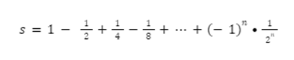
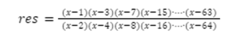

## Задача 1. Космическая еда

**Что нужно сделать**

Ваш космический корабль потерпел крушение на пустынной планете. Еда здесь не растёт, но вы спасли из обломков 100-килограммовый мешок гречки. Из прошлого опыта вы знаете, что если будете экономно питаться, то у вас будет уходить по четыре килограмма гречки в месяц.

Чтобы прикинуть гречневый бюджет, вы решили написать программу, которая выведет информацию о том, сколько килограммов гречки у вас должно быть в запасе через месяц, два и так далее, пока она не закончится. Используйте цикл for.

## Задача 2. Долги

**Что нужно сделать**

«МирПрогБанк» наконец-то разделил законопослушных граждан и должников и поместил их в разные базы. Но банк не торопится сильно давить на неплательщиков. Операторам банка дали задание позвонить каждому пятому должнику из списка (нумерация начинается с нуля) и уточнить, какую сумму каждый из них задолжал банку.

Напишите программу, которая получает данные о количестве должников, а затем спрашивает у каждого пятого (начиная с 0) его долг. В конце выводится общая сумма долгов.

**Пример 1:**

- Введите количество должников: 13
- Должник с номером 0
- Сколько должны? 1000
- Должник с номером 5
- Сколько должны? 5000
- Должник с номером 10
- Сколько должны? 2000
- Общая сумма долга: 8000

**Пример 2:**

- Введите количество должников: 10
- Должник с номером 0
- Сколько должны? 1000
- Должник с номером 5
- Сколько должны? 5000
- Общая сумма долга: 6000

## Задача 3. Это будет бомба

**Что нужно сделать**

Мы разрабатываем пошаговую игру по мотивам боевика. Задача центрального персонажа — обезвредить бомбу, которая взорвётся через N секунд. Программа спрашивает пользователя, хочет ли он обезвредить бомбу сейчас.

Если ответ 0 (то есть «нет»), то счётчик бомбы уменьшается. Если он достиг нуля, то программа выдаёт сообщение «Бомба взорвалась», а если не достиг, то программа снова переспрашивает, не хочет ли игрок обезвредить бомбу, и сообщает, сколько времени осталось до взрыва. Если ответ «да», то программа выводит на экран сообщение о том, что бомба обезврежена за ХХ секунд до взрыва.

- Задайте время до обнуления таймера.
- Используйте цикл for.
- На каждой итерации задавайте персонажу вопрос, хочет ли он сейчас обезвредить бомбу или будет дальше нагнетать атмосферу игры.

## Задача 4. Среднее на отрезке

**Что нужно сделать**

Напишите программу, которая считывает с клавиатуры два числа a и b, считает и выводит на консоль среднее арифметическое всех чисел из отрезка [a; b], кратных числу c.

## Задача 5. Функция 2

**Что нужно сделать**

В прошлый раз мы написали Саше программу, которая считает функцию в каждой точке отрезка и выводит значение на экран. Но теперь ему нужно, чтобы значения считались в обратном порядке. Также Саше важно настроить шаг, с которым он скачет по точкам отрезка.

Напишите программу, которая получает на вход начало и конец отрезка, а также шаг. Затем высчитывает функцию игрек в каждой точке отрезка и с нужным шагом, начиная с конца, выводит ответ на экран.

Сама функция выглядит так:

y= x3+2∙x2-4∙x+1

y = (x\*\*3) + (2\*x\*\*2) - (4\*x - 1)

**Пример:**

- Введите начало отрезка: -2
- Введите конец отрезка: 2
- Введите шаг: -1
- В точке 2 функция равна 9
- В точке 1 функция равна 0
- В точке 0 функция равна 1
- В точке -1 функция равна 6
- В точке -2 функция равна 9

**Советы и рекомендации**

Функция range(start, stop) не включает границу stop, останавливается, не доходя до неё.

## Задача 6. Письмо

**Что нужно сделать**

У нас есть квадратный конверт размера 12х12 сантиметров и письмо на квадратном листе бумаги, которое не помещается в конверт. Напишите программу, которая подскажет, сколько раз нужно сложить письмо пополам, чтобы оно поместилось в конверт. Размеры письма вводятся с клавиатуры.

**Советы и рекомендации**

Обратите внимание, что лист квадратный.

Принимаем, что лист размером 12х12 свободно входит в конверт 12х12.

## Задача 7. Стипендия

**Что нужно сделать**

Ежемесячная стипендия студента составляет educational_grant рублей, а расходы на проживание превышают стипендию и составляют expenses рублей в месяц. Рост цен ежемесячно увеличивает расходы на 3%, кроме первого месяца. Составьте программу расчёта суммы денег, которую необходимо получить у родителей один раз в начале обучения, чтобы можно было прожить учебный год (десять месяцев), используя только эти деньги и стипендию.

**Пример:**

- Введите стипендию: 10000
- Введите расходы на проживание: 13000
- У родителей необходимо попросить 49030.431

## Задача 8. Сумма ряда

**Что нужно сделать**

Дано натуральное число N. Напишите программу для вычисления следующей суммы ряда (начиная с единицы):

Допускается вывод без описания, достаточно вывести сумму ряда.

**Советы и рекомендации**

Обратите внимание: если мы воспользуемся формулой для расчёта члена ряда, то

- при n = 0, член ряда равен 1;
- при n = 1, мы получим -1/2;
- при n = 2, мы получим 1/4;
- при n = 3, мы получим -1/8.

## Задача 9. Выражение

**Что нужно сделать**

Дано число x. Напишите программу для вычисления следующего выражения:

**Советы и рекомендации**

Обратите внимание на последовательность в числителе и знаменателе. Эта последовательность не является возрастающей арифметической последовательностью 1, 3, 5, 7 … 63 и 2, 4, 6, 8 … 64.

Допускается вывод без описания, достаточно вывести сумму ряда.

## Задача 10. Кинотеатр

**Что нужно сделать**

X мальчиков и Y девочек пошли в кинотеатр и купили билеты на идущие подряд места в одном ряду. Напишите программу, которая выдаст, как нужно сесть мальчикам и девочкам, чтобы рядом с каждым мальчиком сидела хотя бы одна девочка, а рядом с каждой девочкой — хотя бы один мальчик.

На вход подаются два числа: количество мальчиков X и количество девочек Y. В ответе выведите какую-нибудь строку, в которой будет ровно X символов B (обозначающих мальчиков) и Y символов G (обозначающих девочек), удовлетворяющую условию задачи.

Пробелы между символами выводить не нужно. Если рассадить мальчиков и девочек согласно условию задачи невозможно, выведите строку «Нет решения».

**Пример 1:**

- Введите количество мальчиков: 5
- Введите количество девочек: 5
- Ответ: BGBGBGBGBG

**Пример 2:**

- Введите количество мальчиков: 5
- Введите количество девочек: 3
- Ответ: BGBGBBGB

**Пример 3:**

- Введите количество мальчиков: 100
- Введите количество девочек: 1
- Ответ: Нет решения
